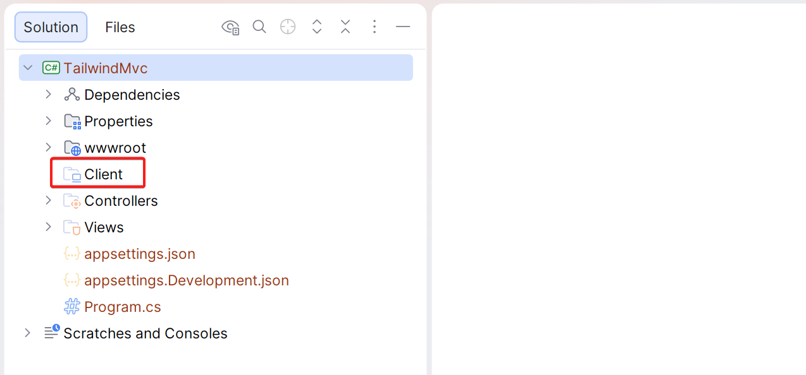
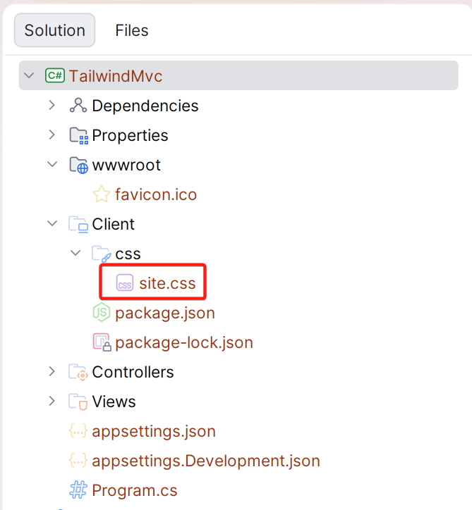
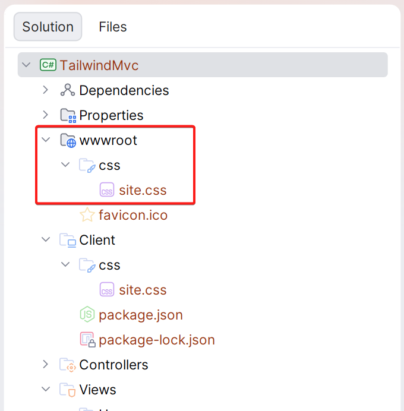

## Introduction

In this blog post, I will demonstrate how to add [Tailwind 4](https://tailwindcss.com/) to an existing ASP.NET Core MVC or Razor Pages application. The approach I am using is a simple yet effective method that works well when you don't have a complex client-side build and only want to generate a CSS file based on the Tailwind utility classes you use in your project.

If you have a more complex build pipeline for your front-end, I am going to assume you already have some sort of build process that takes care of the Tailwind build as part of that build pipeline.

## Install Tailwind

For this blog post, I’ll start with a basic MVC project I created using `dotnet new mvc`. I deleted some of the default views and the CSS and JavaScript files created by the template.

Next, I added a `Client` directory to my project since it allows me to keep the client source files separate from the rest of the ASP.NET Core application.



Go to the terminal and run the following command inside the `Client` directory:

```bash
npm install tailwindcss @tailwindcss/cli
```

This creates a `package.json` and installs the `tailwindcss` NPM package, along with the [Tailwind CLI](https://tailwindcss.com/docs/installation/tailwind-cli).

## Add a CSS file

Next, you can add a CSS file where we will add the Tailwind configuration. In my case, I add a `css` directory under the `Client` directory, and created a new `site.css` file inside this directory.



Add the following CSS to this file:

```css
@import "tailwindcss";

/* Configure the correct source depending on whether you use MVC or Razor Pages (or both) */
@source "../../Views/";
@source "../../Pages/";
```

The `@source` directive tells Tailwind which files and folders to scan for the use of Tailwind utility classes. In the example above, we scan both the `Views` and `Pages` folders, but you can update this to include either the one or the other, depending on whether you use MVC or Razor Pages.

If you use Areas or use Tailwind utility classes inside your C# code, you will need to include the relevant directories for those as well. Make sure to specify a path relative to the `site.css` file.

## Generate the CSS

Next up, we need to generate an output CSS file from this source file. We want this output file to placed inside the `wwwroot\css` directory. For this, we can run the following command from the `Client` directory.

```bash
npx @tailwindcss/cli -i ./css/site.css -o ../wwwroot/css/site.css
```

This command indicates to the Tailwind CLI that it should generate a CSS file at `../wwwroot/css/site.css` and use `./css/site.css` as the input (or source) file.

You can run this command now, and you will see a file being generated, but doing this manually each time will not be practical. Instead, we want to make this part of the build process.

To do that, update the `csproj` file and add the following:

```xml
<Target Name="Tailwind" BeforeTargets="Build">
  <Exec WorkingDirectory="Client" Command="npm install"
	  Condition=" !Exists('Client/node_modules') "
  />
  <Exec Command="npx @tailwindcss/cli -i ./css/site.css -o ../wwwroot/css/site.css"
	  WorkingDirectory="Client"
  />
</Target>
```

This will declare a target named `Tailwind` that will execute every time you do a build. This target will execute two tasks:

1. The first task will perform an `npm install` if the `node_modules` directory does not exist. On your local machine, the `node_modules` directory already exists, but in the CI environment, it will probably not, so this takes care of it.
2. The second task will invoke the Tailwind CLI and generate the CSS file for our application.

At this point, you can build your project and confirm that the CSS file is generated inside the `wwwroot/css` directory.



## Add the CSS file to your Layout

You will need to add the generated CSS file to your layout. Open your `_Layout.cshtml` (or whatever the name of your layout file is) and add a link to the generated CSS file.

```razor
<!DOCTYPE html>
<html lang="en">
  <head>
    <meta charset="utf-8" />
    <meta name="viewport" content="width=device-width, initial-scale=1.0" />
    <title>@ViewData["Title"] - TailwindMvc</title>
    <link rel="stylesheet" href="~/css/site.css" />
  </head>
  <body>
    @RenderBody()

    @await RenderSectionAsync("Scripts", required: false)
  </body>
</html>
```

## Start using Tailwind inside your Views and Razor Pages

At this point, all is set for you to start using Tailwind inside your MVC Views and/or Razor Pages. To test it, let’s use the code from [one of the free Hero sections in the Tailwind Plus package](https://tailwindcss.com/plus/ui-blocks/marketing/sections/heroes).


## Conclusion

In this blog post, I demonstrated how to add Tailwind to your ASP.NET Core MVC or Razor Pages project and use the Tailwind CLI inside an MSBuild task to generate a CSS file every time you build your application.

You can find the sample applications I created for this blog post online. I have created both an [MVC](https://github.com/dune-ui/blog-posts/tree/main/TailwindMvc) and [Razor Pages](https://github.com/dune-ui/blog-posts/tree/main/TailwindRazor) version.
