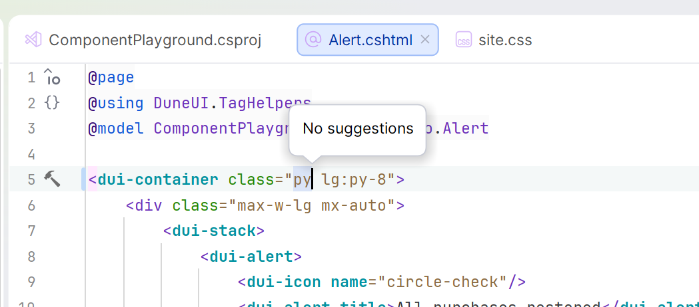
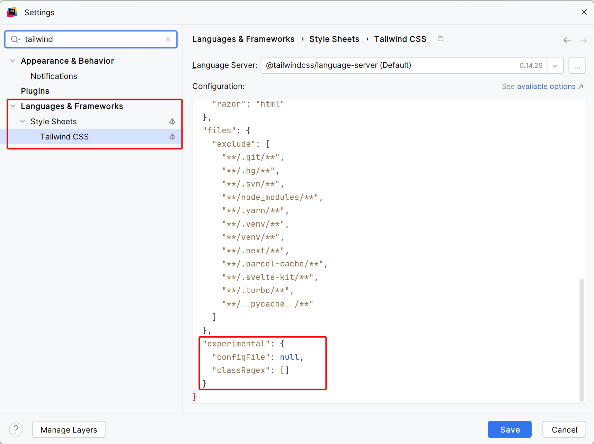
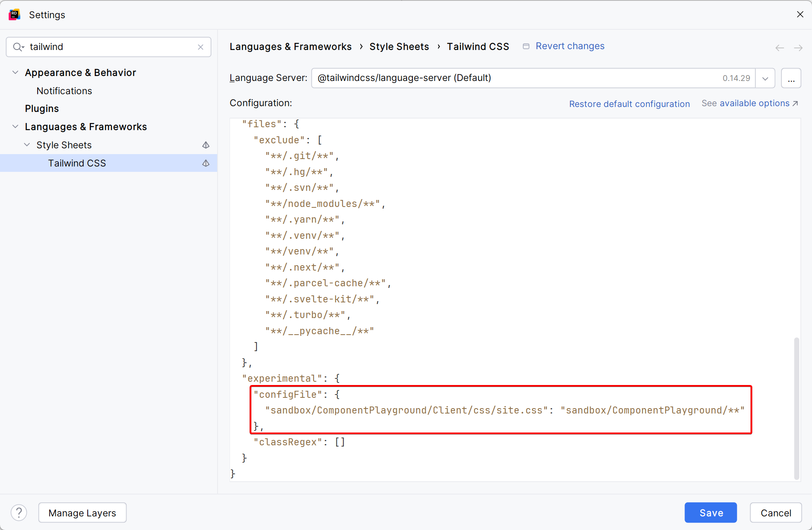
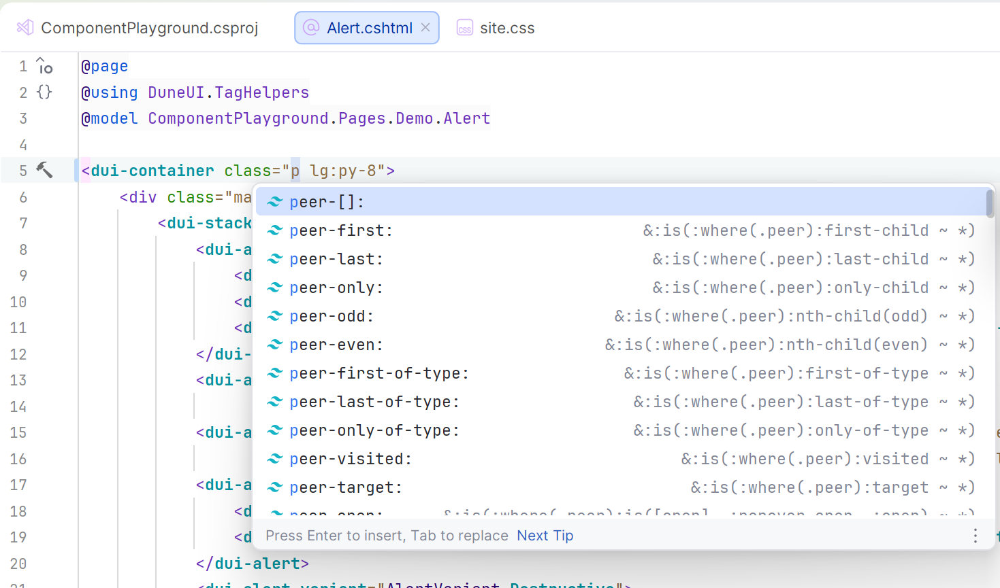

Jetbrains Rider has [code completion for Tailwind 4](https://www.jetbrains.com/help/rider/Tailwind_CSS.html) which assist you with completing Tailwind utility classes.

This code completion works without requiring any additional configuration most of the time. However, sometimes the Tailwind language server used by the code completion is unable to suggest classes correctly.

I came across this issue while working on some of the code examples for [StellarAdmin](https://www.duneui.com/).



One of the possible reasons for this is that the language server is unable to discover your Tailwind configuration. You can help the Tailwind language server along by explicitly indicating the location of the CSS file containing your Tailwind configuration.

To do this, navigate to your Tailwind language server settings and locate the `experimental` section.



You should notice that there is a `configFile` attribute which is set to `null` by default. As per [the Tailwind language server documentation](https://github.com/tailwindlabs/tailwindcss-intellisense?tab=readme-ov-file#tailwindcssexperimentalconfigfile), you can use this setting to manually specify the CSS entrypoint(s) - i.e. the CSS file(s) that contain your Tailwind configuration.

You can specify a single entry point as follows:

```json
"tailwindCSS.experimental.configFile": "src/styles/app.css"
```

Or, if your project contains multiple entrypoints, you can specify an object where the key is the path to the CSS entrypoint, and the value is the glob pattern of the files it applies to.

```json
"tailwindCSS.experimental.configFile": {
  "packages/a/src/app.css": "packages/a/src/**",
  "packages/b/src/app.css": "packages/b/src/**"
}
```

In my case, I updated the configuration as follows:



This indicates to the Tailwind language server that it should use the Tailwind configuration in the file `sandbox/ComponentPlayground/Client/css/site.css` for all files located under the directory `sandbox/ComponentPlayground/`.

With this in place, the code completion is working correctly.



For more complete documentation on the Tailwind Language Server, you can refer to [their online documentation](https://github.com/tailwindlabs/tailwindcss-intellisense?tab=readme-ov-file#extension-settings).
