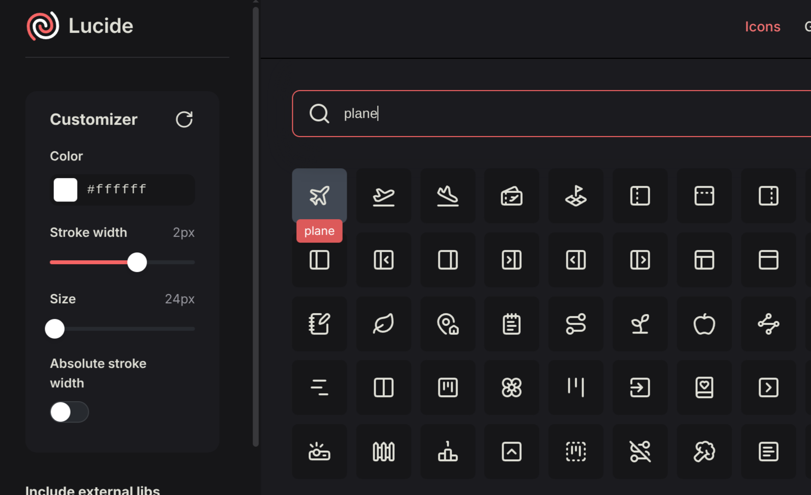
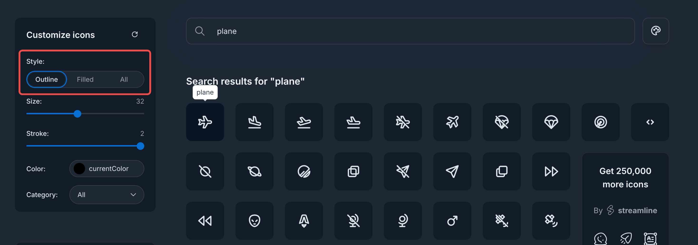

import { Demo } from "@/components/demo";

## Built-in icons

StellarAdmin Tag Helpers ships the [Lucide](https://lucide.dev/) icon set which is added automatically when calling `AddStellarAdmin()`, so every Lucide icon is available from the [`<sa-icon>`](/docs/tag-helpers/components/icon) Tag Helper by name, without further setup:

To find an icon's name, search the [Lucide icons page](https://lucide.dev/icons/) and use the name shown when you hover over an icon. Names are matched case-insensitively. 



Specify the name of the icon in the `name` attribute. 

```razor
<sa-icon name="plane"/>
```

<Callout>
  When no icon matches, `<sa-icon>` renders a placeholder "not found" icon rather than nothing, so a typo is visible in the page.
</Callout>

Icons render as inline `<svg>` elements that use `currentColor`, so they take the color and size of their surroundings. See the [Icon](/docs/tag-helpers/components/icon) page for sizing, color and stroke width.

## Icon packs

StellarAdmin supports icon packs, which are a set of icons packaged together. You can load an icon pack using the `AddIconPack<T>()` method available on the `StellarAdminBuilder`.

```cs
builder.Services.AddStellarAdmin(sa =>
{
    sa.AddIconPack<MyCustomIconPack>();
});
```

### Tabler icon packs

Besides the `LucideIconPack` which is loaded by default, StellarAdmin also includes outline and filled versions of the [Tabler Icons](https://tabler.io/icons) which are available as `TablerOutlineIconPack` and `TablerFilledIconPack` respectively.

```cs
builder.Services.AddStellarAdmin(sa =>
{
    sa.AddIconPack<TablerOutlineIconPack>();
});
```

If you want to see the available icons for both of these, you can go to the [Tabler Icons search page](https://tabler.io/icons) and search for an icon you want to use. You can view the name of the icon in the tooltip when hovering over the icon. You can limit the search to either the outline or filled icon versions by using the *Style* selector.



### Prefixing an icon pack

By default, an icon pack will override any previously registered icons with the same name. Specify a prefix in the registration callback to keep a pack's icon names separate from other packs.

```csharp
builder.Services.AddStellarAdmin()
    .AddIconPack<TablerOutlineIconPack>(pack =>
    {
        pack.Prefix = "tabler:";
    });
```

The prefix is literal, so an icon named `plane` becomes `tabler:plane` and can be used as `<sa-icon name="tabler:plane" />`.


## Adding your own icons

Custom icons can be registered using the `AddIcon()` method of `StellarAdminBuilder`. An icon is added using a `name` and an `IconDefinition` which defines the attributes for the `<svg>` element and the list of shapes (`path`, `circle`, `rect`, and so on) used to draw the icon.

```cs
using System.Collections.Immutable;
using StellarAdmin.Icons;

builder.Services.AddStellarAdmin()
    .AddIcon("voyager-suitcase", new IconDefinition(
        new Dictionary<string, string>
        {
            ["xmlns"] = "http://www.w3.org/2000/svg",
            ["width"] = "24",
            ["height"] = "24",
            ["viewBox"] = "0 0 24 24",
            ["fill"] = "none",
            ["stroke"] = "currentColor",
            ["stroke-width"] = "2",
            ["stroke-linecap"] = "round",
            ["stroke-linejoin"] = "round",
        },
        [
            new SvgShape("rect", new Dictionary<string, string>
            {
                ["x"] = "3", ["y"] = "7", ["width"] = "18", ["height"] = "13", ["rx"] = "2",
            }.ToImmutableDictionary()),
            new SvgShape("path", new Dictionary<string, string>
            {
                ["d"] = "M8 7V5a2 2 0 0 1 2-2h4a2 2 0 0 1 2 2v2",
            }.ToImmutableDictionary()),
            new SvgShape("path", new Dictionary<string, string> { ["d"] = "M8 7v13" }.ToImmutableDictionary()),
            new SvgShape("path", new Dictionary<string, string> { ["d"] = "M16 7v13" }.ToImmutableDictionary()),
        ]))
    .AddTagHelpers();
```

```razor
<sa-icon name="voyager-suitcase"/>
```

<Callout type="warn">
  Duplicate names, including built-in icon names, cause an exception when icon options are resolved. To replace a built-in icon, register an icon pack.
</Callout>

### Create an icon pack

For more than a handful of icons, or to override existing ones, implement `IIconPack` and register it by calling `AddIconPack<T>()`. An icon pack returns a dictionary of icon names and definitions. When a pack contains an icon with a name that is already registered, the pack's icon replaces the existing one.

```cs
using System.Collections.Immutable;
using StellarAdmin.Icons;

public class VoyagerIconPack : IIconPack
{
    private static readonly Dictionary<string, string> SvgAttributes = new()
    {
        ["xmlns"] = "http://www.w3.org/2000/svg",
        ["width"] = "24",
        ["height"] = "24",
        ["viewBox"] = "0 0 24 24",
        ["fill"] = "none",
        ["stroke"] = "currentColor",
        ["stroke-width"] = "2",
        ["stroke-linecap"] = "round",
        ["stroke-linejoin"] = "round",
    };

    public IDictionary<string, IconDefinition> GetIcons()
    {
        return new Dictionary<string, IconDefinition>
        {
            ["voyager-suitcase"] = new IconDefinition(SvgAttributes,
            [
                Shape("rect", ("x", "3"), ("y", "7"), ("width", "18"), ("height", "13"), ("rx", "2")),
                Shape("path", ("d", "M8 7V5a2 2 0 0 1 2-2h4a2 2 0 0 1 2 2v2")),
                Shape("path", ("d", "M8 7v13")),
                Shape("path", ("d", "M16 7v13")),
            ]),
            ["voyager-compass"] = new IconDefinition(SvgAttributes,
            [
                Shape("circle", ("cx", "12"), ("cy", "12"), ("r", "9")),
                Shape("path", ("d", "m15.5 8.5-2 5-5 2 2-5z")),
                Shape("path", ("d", "M12 3v2")),
                Shape("path", ("d", "M12 19v2")),
                Shape("path", ("d", "M3 12h2")),
                Shape("path", ("d", "M19 12h2")),
            ]),
        };
    }

    private static SvgShape Shape(string name, params (string Name, string Value)[] attributes)
    {
        return new SvgShape(name, attributes.ToImmutableDictionary(a => a.Name, a => a.Value));
    }
}
```

```cs
builder.Services.AddStellarAdmin()
    .AddIconPack<VoyagerIconPack>();
```

The two custom icons then render alongside the built-in ones:

<Demo src="/demo/tag-helpers/icon-custom.html">
  <include>./components/_include/icon-custom.mdx</include>
</Demo>

## Semantic component icons

Various StellarAdmin Tag Helpers uses icons when rendering. For example, [`<sa-pagination-ellipses>`](http://localhost:3000/docs/tag-helpers/components/pagination#sa-pagination-ellipsis) renders a small ellipses. These icons are provided by the various icon packs as *semantic icons* - in other words, some icons are registered by their *purpose*. In the example of `<sa-pagination-ellipses>` Tag Helper, it will look up the `SemanticIconRole.PaginationEllipsis` icon when rendering the ellipsis.

When registering a new icon pack, it's semantic icons will override any semantic icons previously registered by another icon pack. You can prevent this by setting `ImportSemanticMappings` to false when registering the icon pack.

```csharp
builder.Services.AddStellarAdmin()
    .AddIconPack<VoyagerIconPack>(pack =>
    {
        pack.ImportSemanticMappings = false;
    });
```

### Supply semantic icons from your own icon packs

If you create your own custom icon pack, you can supply these mappings by implementing `GetSemanticIconMappings()`.

```csharp
public IReadOnlyDictionary<SemanticIconRole, string> GetSemanticIconMappings()
{
    return new Dictionary<SemanticIconRole, string>
    {
        [SemanticIconRole.PaginationEllipsis] = "my-dots",
        [SemanticIconRole.DropdownIndicator] = "my-caret-down",
    };
}
```

Each mapped name must exist in the icons supplied by that same pack, even if an icon with that name is already registered, otherwise registration throws `ArgumentException`. 

### Override a single semantic icon

You can override the icons used for a specific semantic role:

```csharp
builder.Services.Configure<IconOptions>(icons =>
{
    icons.MapSemanticIcon(SemanticIconRole.PaginationEllipsis, "ellipsis-vertical");
});
```

## Removing all icons

As mentioned previously, the Lucide icons are registered by default. You can clear all previously registered icons by calling `ClearIcons()` and register a new icon pack by calling `AddIconPack<T>()`.

```cs
builder.Services.AddStellarAdmin()
    .ClearIcons();
    .AddIconPack<VoyagerIconPack>();
```

## API Reference

### `AddIcon(name, iconDefinition)`

Registers a single icon under a new name. Duplicate names throw when icon options are resolved.

### `AddIconPack<TIconPack>()`

Creates an instance of `TIconPack` (which must have a parameterless constructor) and registers its icons and semantic mappings. Icons with the same name as an existing icon replace it.

### `IIconPack`

<TypeTable
  type={{
    GetSemanticIconMappings: {
      description: "Returns semantic roles mapped to icon names supplied by this pack; defaults to an empty mapping.",
      type: "IReadOnlyDictionary<SemanticIconRole, string>",
    },
    GetIcons: {
      description: "Returns the icons in the pack, keyed by name.",
      type: "IDictionary<string, IconDefinition>",
    },
  }}
/>

### `IconDefinition`

<TypeTable
  type={{
    Attributes: {
      description:
        "The attributes rendered on the <svg> element, such as viewBox, fill and stroke. Attributes supplied on <sa-icon> take precedence.",
      type: "IDictionary<string, string>",
    },
    Shapes: {
      description: "The shapes rendered inside the <svg> element, in order.",
      type: "List<SvgShape>",
    },
  }}
/>

### `SvgShape`

<TypeTable
  type={{
    Name: {
      description: "The SVG element name, such as path, circle, rect, line or polyline.",
      type: "string",
    },
    Attributes: {
      description: "The attributes rendered on the shape element, such as d, cx, cy or r.",
      type: "IImmutableDictionary<string, string>",
    },
  }}
/>
