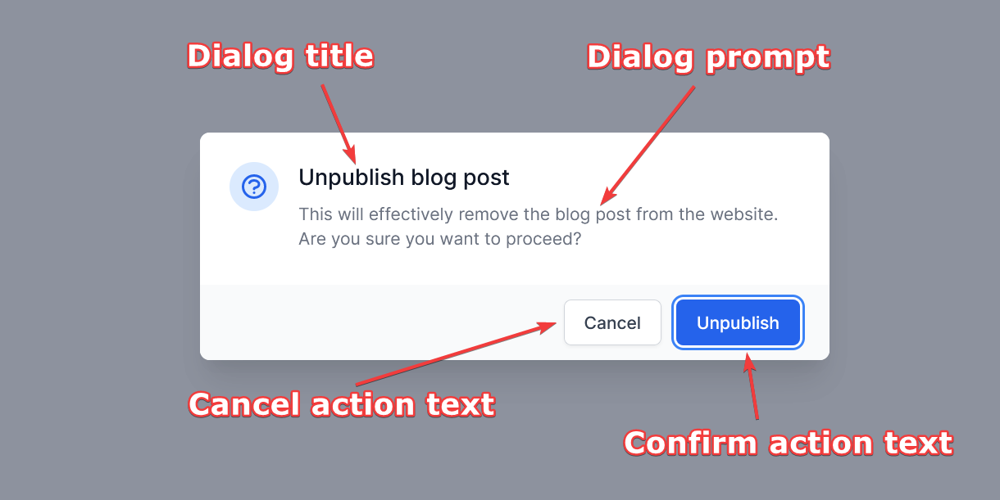
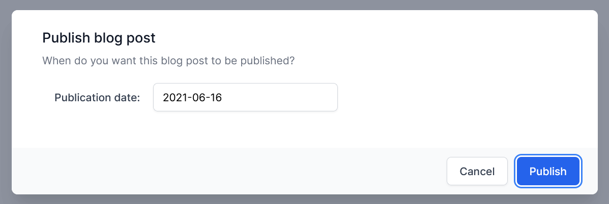
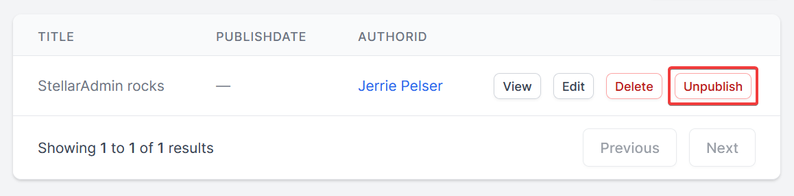
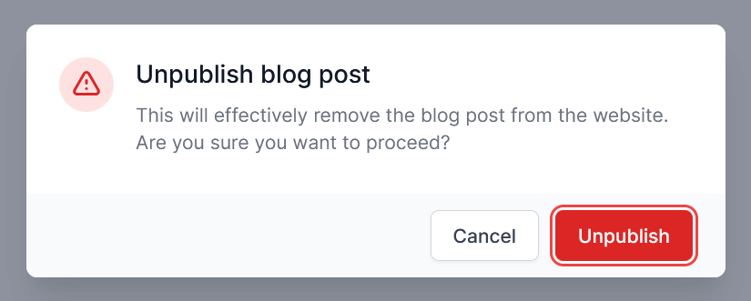

order: 7
---

## Introduction

StellarAdmin has a standard set of actions that a user can perform on a resource, such as editing and deleting a resource. You may want to allow the user to perform other actions on a resource, for example, marking an order as delivered or publishing a blog post.

StellarAdmin allows you to define custom actions for a resource that will be available to the user.


## Types of Actions

You to define three different kinds of custom actions:

1. **Simple actions** will execute immediately after a user has clicked the button for the action.
2. **Confirmable actions** will prompt the user for confirmation before the action executed.
3. **Form actions** will prompt the user to supply input that the action can use on execution.

### Defining a Simple Action

To create a simple action, inherit from the `SimpleResourceAction` class and override the `Execute` method to perform the business logic required. The `keys` parameter will contain a list of primary key values for the resources on which the action must be performed. The `context` parameter will give you access to various properties of the context in which the action was executed. You can inject any services required by your action in the action constructor.

The code below demonstrates a simple action that clears the `PublishDate` of the selected blog posts.

```cs
public class UnpublishPost : SimpleResourceAction
{
    private readonly BlogDbContext _dbContext;

    public UnpublishPost(BlogDbContext dbContext)
    {
        _dbContext = dbContext;
    }
    
    public override async Task<ActionResult> Execute(object[] keys, ActionRequestContext context)
    {
        if (keys != null)
        {
            foreach (var key in keys)
            {
                var blogPost = await _dbContext.BlogPosts.FindAsync(new Guid(key.ToString() ?? string.Empty));
                if (blogPost != null)
                {
                    blogPost.PublishDate = null;
                }
            }

            await _dbContext.SaveChangesAsync();
        }

        return ActionResult.Success().WithRefresh().WithNotification("The blog post was unpublished");
    }
}
```

After you have created your action class, you need to register it in the resource builder. Call the `AddSimpleAction` method, specifying the type of your action class as the generic parameter and the text to be displayed on the button that executes the action as the `label` parameter.

```cs
builder.AddResource<BlogPost>(rb =>
{
    // ...

    rb.AddSimpleAction<UnpublishPost>("Unpublish");
});
```

### Defining a Confirmable Action

Defining a confirmable action is the same process as for simple actions, but you need to inherit from the `ConfirmationResourceAction` class.

```cs
public class UnpublishPost : ConfirmationResourceAction
{
    // ...

    public override async Task<ActionResult> Execute(object[] keys, ActionRequestContext context)
    {
        // ...
    }
}
```

To register the action with your resource, call the `AddConfirmationAction` method.

```cs
builder.AddResource<BlogPost>(rb =>
{
    // ...

    rb.AddConfirmationAction<UnpublishPost>("Unpublish",
        actionBuilder =>
        {
            actionBuilder.HasDialogTitle("Unpublish blog post");
            actionBuilder.HasDialogPrompt("This will effectively remove the blog post from the website. Are you sure you want to proceed?");
            actionBuilder.HasConfirmActionText("Unpublish");
        });
});
```

You can specify extra parameters during the action registration to change the text displayed in the confirmation dialog. Call the `HasDialogTitle()`, `HasDialogPrompt()`, `HasConfirmActionText()`, and `HasCancelActionText()` methods to specify these values. 



### Defining a Form Action

A form action requires a model class representing the fields the user will supply in the dialog. Let's say we want to create an action that allows a user to publish a blog post. The action dialog should prompt the user for the date the blog post will be published. We can define a class called `PublishBlogPostModel` with a property named `PublishDate`.

```cs
public class PublishBlogPostModel
{
    public DateTime PublishDate { get; set; }
}
```

To implement the action, create a new class that inherits from `FormResourceAction<TModel>`, passing the model class you created as the `TModel` generic parameter.

```cs
public class PublishBlogPost : FormResourceAction<PublishBlogPostModel>
{
    // ...
}
```

The signature of the execute method is a little bit different from the simple and confirmable actions, as you will also be passed a `model` parameter. This parameter contains an instance of the model class with the values entered by the user. The code sample below demonstrates the complete implementation of a form resource action.

```cs
public class PublishBlogPostModel
{
    public DateTime PublishDate { get; set; }
}

public class PublishBlogPost : FormResourceAction<PublishBlogPostModel>
{
    private readonly BlogDbContext _dbContext;

    public PublishBlogPost(BlogDbContext dbContext)
    {
        _dbContext = dbContext;
    }
    protected override async Task<ActionResult> Execute(object[] keys, PublishBlogPostModel model, FormActionRequestContext context)
    {
        if (keys != null)
        {
            foreach (var key in keys)
            {
                var blogPost = await _dbContext.BlogPosts.FindAsync(new Guid(key.ToString() ?? string.Empty));
                if (blogPost != null)
                {
                    blogPost.PublishDate = model.PublishDate;
                }
            }

            await _dbContext.SaveChangesAsync();
        }

        return ActionResult.Success().WithRefresh().WithNotification("The blog post was published successfully");
    }
}
```

To register the action with your resource, you need to call the `AddFormAction` method, passing the action class and action model classes as generic parameters. You will also need to declare fields for each of your action model class properties by calling the `AddField()` method. 

As for the confirmable action, you can also alter the dialog title, prompt, etc, by calling the appropriate methods.

```cs
builder.AddResource<BlogPost>(rb =>
{
    // ...

    rb.AddFormAction<PublishBlogPost, PublishBlogPostModel>("Publish",
        actionBuilder =>
        {
            actionBuilder.HasDialogTitle("Publish blog post");
            actionBuilder.HasDialogPrompt("When do you want this blog post to be published?");
            actionBuilder.HasConfirmActionText("Publish");
            
            actionBuilder.AddField(m => m.PublishDate, f =>
            {
                f.HasLabel("Publication date:");
                f.HasEditor<DateEditor>();
            });
        });
});
```

The code sample above will result in the following dialog:



## Performing destructive actions

Some actions are destructive as they can irreversibly alter resources. For such actions, you can indicate to the user that they are about to perform a dangerous action by calling the `IsDestructive()` method during registration.

```
builder.AddResource<BlogPost>(rb =>
{
    // ...

    rb.AddConfirmationAction<UnpublishPost>("Unpublish",
        actionBuilder =>
        {
            // ...

            actionBuilder.IsDestructive();
        });
});
```

The button the user clicks will give a visual indication that the action is dangerous.



For actions that display a dialog, the appearance of the dialog icon and confirm button will also be altered to indicate to the user that they are about to perform a dangerous action.



## Action results

An action must return an `ActionResult` that indicates either success or failure. To return a successful result, you can return `ActionResult.Success()`. Conversely, you can return `ActionResult.Failure()` to indicate that the action was not executed successfully.

You can also alter the response by chaining the following methods to the response:

* `WithRefresh()` indicates to StellarAdmin that it should refresh the current view. You should call this whenever you perform an action that alters the content of the current page. Otherwise, the changes made by your action will not be reflected.
* `WithNotification("...")` will display a notification toast with the text specified to the user. The visual appearance of the toast will depend on whether the action was successful or not.

You can refer to the various code examples earlier in this document to see this in action.