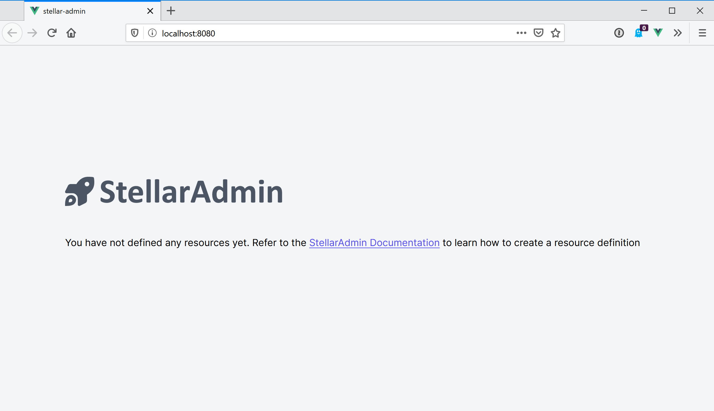

xref: get-started
order: 2
---

## Requirements

StellarAdmin requires ASP.NET Core 3.1.

## Install packages

To add StellarAdmin to your ASP.NET Core application, install the `StellarAdmin` NuGet package. If you intend to use StellarAdmin with Entity Framework 3, you can also install the `StellarAdmin.EntityFrameworkCore` package.

```bash
dotnet add package StellarAdmin
dotnet add package StellarAdmin.EntityFrameworkCore
```

## Register services

Once installed, you must configure StellarAdmin in your application's `Startup` class by calling the `AddStellarAdmin` extension method inside the `ConfigureServices` method. StellarAdmin also depends on the **Razor Pages** services, so be sure to register those by calling the `AddRazorPages` extension method.

```cs
public void ConfigureServices(IServiceCollection services)
{
    // some code omitted for brevity

    // Razor Pages is required by StellarAdmin
    services.AddRazorPages();

    // Register the StellarAdmin services, resources and actions
    services.AddStellarAdmin();
}
```

## Register endpoints

The final part of the configuration is to add the endpoints for StellarAdmin in the `Configure` method of your `Startup` class. Once again, StellarAdmin depends on some **Controller** and **Razor Pages** endpoints, so you must register them by calling the `MapControllers` and `MapRazorPages` extension methods. After those are added, you can add the StellarAdmin endpoints by calling the `MapStellarAdmin` extension method.

```cs
public void Configure(IApplicationBuilder app, IWebHostEnvironment env)
{
    // some code omitted for brevity

    app.UseEndpoints(endpoints =>
    {
        // Controllers and Razor Pages are required by StellarAdmin
        endpoints.MapControllers();
        endpoints.MapRazorPages();

        // Register the routes for the StellarAdmin UI
        endpoints.MapStellarAdmin();
    });
}
```

## Verify configuration

You can verify the configuration running your application and going to the `/StellarAdmin` route. This should display the StellerAdmin UI as in the screenshot below.



## Next

Next, you can define your resources.

* [Define resources](resources)