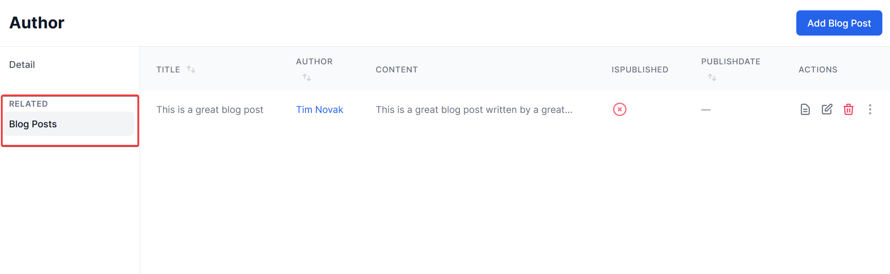

title: Display master-detail relationships with collections
navTitle: Collections (master-detail)
---

StellarAdmin allows you to display master-detail relationships by defining detail collections for parent resources. Let's take the example of a blogging website where a single author can have multiple blog posts.

When defining Blog posts as a collection of the Author resource, it will be displayed under the **Related** section on the Author detail page. Navigating to the blog posts section will display only the blog posts for the particular author.



## Defining a collection

You can define a collection by calling the `AddCollection<>` method on the resource builder, passing the class of the detail resource as the generic parameter.

```cs
services.AddStellarAdmin(builder =>
{
    builder.AddResource<Author>(rb =>
    {
        rb.AddCollection<BlogPost>();

        // ...
    });
    builder.AddResource<BlogPost>(rb =>
    {
        // ...
    });
}
```

It is important that you also create a resource definition for the detail resource, as you can see with the call to `AddResource<BlogPost>` in the preceding code sample.

## Filtering detail resources

Once you have added the collection, you need to filter the detail resources based on the parent resource. The implementation will depend on the data source you are using.

### Using the Delegate datasource

When using the Delegate datasource, you can check whether a master resource filter is passed in the `OnGetList` handler and filter the detail resource based on that filter.

* The `ResourceType` property of the `MasterResourceFilter` class will contain the type of the master resource.
* The `ResourceKey` property of the `MasterResourceFilter` class will contain the primary key value of the master resource. This is passed as an `object`, so you may need to convert it to the correct data type.

It is up to you as to how you use this information to filter the detail resources. If your data source is a 3rd party API you can pass the relevant filter criteria to the API. If you are manually querying data, it is up to you to construct your database query to take the value into account.

```cs
builder.AddResource<BlogPost>(rb =>
{
    // ...

    rb.UseDataSource(options =>
    {
        options.OnGetList = request =>
        {
            if (request.Query.MasterResourceFilter != null)
            {
                var masterResourceType = request.Query.MasterResourceFilter.ResourceType;
                var masterResourceKey = request.Query.MasterResourceFilter.ResourceKey;
                if (masterResourceType == typeof(Author))
                {
                    var authorId = Convert.ToInt32(masterResourceKey);

                    // Use this information to filter blog posts written by the specified author
                    // ...
                }
            }

            // ...
        };
    });
});
```

### Using the EF Core datasource

When using EF Core, StellarAdmin will automatically filter the detail resources for you by analyzing your detail entity and determining the reference navigation property and related foreign key ([See the EF Core Relationships documentation](https://docs.microsoft.com/en-us/ef/core/modeling/relationships)).

Let's assume you have declared the following entities:

```cs
public class Author
{
    public int Id { get; set; }

    // ... other properties
}

public class BlogPost
{
    public int Id { get; set; }

    public Author Author { get; set; }

    public int AuthorId { get; set; }

    // ... other properties
}
```

Since the `BlogPost` class has a reference navigation property named `Author` of type `Author`, StellarAdmin will automatically be able to determine the relationship between the two entities and use the `AuthorId` property to filter the blog posts for a specific author.

However, if your model does not contain a reference navigation property but only a foreign key property, you will need to assist StellarAdmin by defining your foreign key property by calling the `UseForeignKey()` method of the collection builder.

As an example let's assume you have the following entity classes:

```cs
public class Author
{
    public int Id { get; set; }

    // ... other properties
}

public class BlogPost
{
    public int Id { get; set; }

    public int AuthorId { get; set; }

    // ... other properties
}
```

Since there is no reference navigation property of type `Author` defined on the `BlogPost` class, StellarAdmin is unable to determine that the `AuthorId` property should be used as the foreign key. You can tell StellarAdmin to use the `AuthorId` property by calling the `UseForeignKey()` method as per the code sample below.

```cs
services.AddStellarAdmin(builder =>
{
    builder.AddEntityResource<BlogDbContext, Author>(rb =>
    {
        rb.AddCollection<BlogPost>(cb => cb.UseForeignKey(post => post.AuthorId));

        // ...
    });
    builder.AddEntityResource<BlogDbContext, BlogPost>(rb =>
    {
        // ...
    });
}
```
