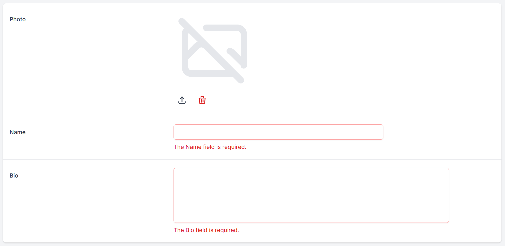

title: Validating your resources
navTitle: Validation
---

## Introduction

StellarAdmin integrates with ASP.NET Core [model validation](https://docs.microsoft.com/en-us/aspnet/core/mvc/models/validation). You can define validation for your resources using the following methods:

* Using [data annotations](https://docs.microsoft.com/en-us/aspnet/core/mvc/models/validation#validation-attributes)
* Implementing [IValidatableObject](https://docs.microsoft.com/en-us/aspnet/core/mvc/models/validation#ivalidatableobject) for class level validation
* Integrate a 3rd party validation library such as [FluentValidation](https://docs.fluentvalidation.net/en/latest/aspnet.html).

## Validating resources

When using the `DbContextDataSource`, StellarAdmin will automatically perform validation on your resources before updating the entity on your database context. However, when you are making use of the `DelegateDataSource`, you will need to perform the validation yourself. StellarAdmin provides a `FormHelpers` class with a `ValidateResource` method that you can call.

## Validating actions

StellarAdmin automatically performs validation on the model specified for form-based actions. All you need to do is to specify validation rules for your model using one of the three methods mentioned at earlier in this document. In the example below, the `PublishDate` property of the action model has a `Required` attribute specified to ensure that the user specifies a value before the action will be executed.

```cs
public class PublishBlogPost : FormResourceAction<PublishBlogPost.PublishBlogPostModel>
{
    public class PublishBlogPostModel
    {
        [Required]
        public DateTime PublishDate { get; set; }
    }

    protected override async Task<ActionResult> Execute(object[] keys, PublishBlogPostModel model, FormActionRequestContext context)
    {
        //...
    }
}
```

## Error display

If your resource or action model has validation errors, StellarAdmin will highlight the fields containing validation errors and display the error message below the field.

