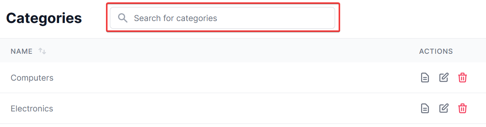
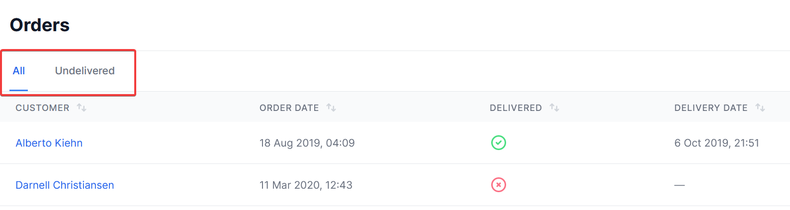

title: Filtering resources
navTitle: Overview
---

## Introduction

StellarAdmin allows two different mechanisms for filtering resources, namely Quick search and Segments. [Quick search](quick-search) allows users to quickly locate resources by typing a search term. 

[Segments](segments) gives users to ability to view a subset of resources based on pre-defined criteria.

