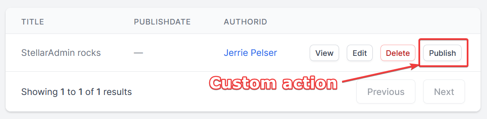

title: Custom actions
navTitle: Custom Actions
xref: actions-intro
---

## Introduction

StellarAdmin has a standard set of actions that a user can perform on a resource, such as editing and deleting a resource. You may want to allow the user to perform other actions on a resource, for example, marking an order as delivered or publishing a blog post.

StellarAdmin allows you to define custom actions for a resource that will be available to the user.

## Types of Actions

You to define three different kinds of custom actions:

1. **Simple actions** will execute immediately after a user has clicked the button for the action.
2. **Confirmable actions** will prompt the user for confirmation before the action executed.
3. **Form actions** will prompt the user to supply input that the action can use on execution.
