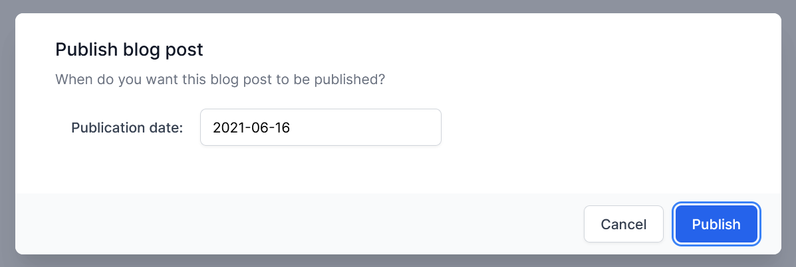

title: Defining actions
---


## Simple actions

To create a simple action handler, inherit from the `SimpleResourceActionHandler` class and override the `Execute` method to perform the business logic required. The `keys` parameter will contain a list of primary key values for the resources on which the action must be performed. The `context` parameter will give you access to various properties of the context in which the action was executed. You can inject any services required by your action in the action constructor.

The code below demonstrates a simple action that clears the `PublishDate` of the selected blog posts.

```cs
public class UnpublishPost : SimpleResourceActionHandler
{
    private readonly BlogDbContext _dbContext;

    public UnpublishPost(BlogDbContext dbContext)
    {
        _dbContext = dbContext;
    }
    
    public override async Task<ActionResult> Execute(object[] keys, ActionRequestContext context)
    {
        if (keys != null)
        {
            foreach (var key in keys)
            {
                var blogPost = await _dbContext.BlogPosts.FindAsync(new Guid(key.ToString() ?? string.Empty));
                if (blogPost != null)
                {
                    blogPost.PublishDate = null;
                }
            }

            await _dbContext.SaveChangesAsync();
        }

        return ActionResult.Success().WithRefresh().WithNotification("The blog post was unpublished");
    }
}
```

After you have created your action class, you need to register it in the resource builder. Call the `AddAction` method, specifying the type of your action handler class as the generic parameter and the text to be displayed on the button that executes the action as the `label` parameter.

```cs
builder.AddResource<BlogPost>(rb =>
{
    // ...

    rb.AddAction<UnpublishPost>("Unpublish");
});
```

## Confirmable actions

Defining a confirmable action is the same process as for simple actions, but you need to inherit from the `ConfirmationResourceActionHandler` class.

```cs
public class UnpublishPost : ConfirmationResourceActionHandler
{
    // ...

    public override async Task<ActionResult> Execute(object[] keys, ActionRequestContext context)
    {
        // ...
    }
}
```

To register the action with your resource, call the `AddAction` method.

```cs
builder.AddResource<BlogPost>(rb =>
{
    // ...

    rb.AddAction<UnpublishPost>("Unpublish",
        actionBuilder =>
        {
            actionBuilder.HasDialogTitle("Unpublish blog post");
            actionBuilder.HasDialogPrompt("This will effectively remove the blog post from the website. Are you sure you want to proceed?");
            actionBuilder.HasConfirmActionText("Unpublish");
        });
});
```

You can specify extra parameters during the action registration to change the text displayed in the confirmation dialog. Call the `HasDialogTitle()`, `HasDialogPrompt()`, `HasConfirmActionText()`, and `HasCancelActionText()` methods to specify these values. 


## Form actions

A form action requires a model class representing the fields the user will supply in the dialog. Let's say we want to create an action that allows a user to publish a blog post. The action dialog should prompt the user for the date the blog post will be published. We can define a class called `PublishBlogPostModel` with a property named `PublishDate`.

```cs
public class PublishBlogPostModel
{
    public DateTime PublishDate { get; set; }
}
```

To implement the action, create a new class that inherits from `FormResourceActionHandler<TModel>`, passing the model class you created as the `TModel` generic parameter.

```cs
public class PublishBlogPost : FormResourceActionHandler<PublishBlogPostModel>
{
    // ...
}
```

The signature of the execute method is a little bit different from the simple and confirmable action handlers, as you will also be passed a `model` parameter. This parameter contains an instance of the model class with the values entered by the user. The code sample below demonstrates the complete implementation of a form resource action handler.

```cs
public class PublishBlogPostModel
{
    public DateTime PublishDate { get; set; }
}

public class PublishBlogPost : FormResourceActionHandler<PublishBlogPostModel>
{
    private readonly BlogDbContext _dbContext;

    public PublishBlogPost(BlogDbContext dbContext)
    {
        _dbContext = dbContext;
    }
    protected override async Task<ActionResult> Execute(object[] keys, PublishBlogPostModel model, FormActionRequestContext context)
    {
        if (keys != null)
        {
            foreach (var key in keys)
            {
                var blogPost = await _dbContext.BlogPosts.FindAsync(new Guid(key.ToString() ?? string.Empty));
                if (blogPost != null)
                {
                    blogPost.PublishDate = model.PublishDate;
                }
            }

            await _dbContext.SaveChangesAsync();
        }

        return ActionResult.Success().WithRefresh().WithNotification("The blog post was published successfully");
    }
}
```

To register the action with your resource, you need to call the `AddAction` method, passing the action handler class and action model classes as generic parameters. You will also need to declare fields for each of your action model class properties by calling the `AddField()` method. 

As for the confirmable action, you can also alter the dialog title, prompt, etc, by calling the appropriate methods.

```cs
builder.AddResource<BlogPost>(rb =>
{
    // ...

    rb.AddAction<PublishBlogPost, PublishBlogPostModel>("Publish",
        actionBuilder =>
        {
            actionBuilder.HasDialogTitle("Publish blog post");
            actionBuilder.HasDialogPrompt("When do you want this blog post to be published?");
            actionBuilder.HasConfirmActionText("Publish");
            
            actionBuilder.AddField(m => m.PublishDate, f =>
            {
                f.HasLabel("Publication date:");
                f.HasEditor<DateEditor>();
            });
        });
});
```

The code sample above will result in the following dialog:


